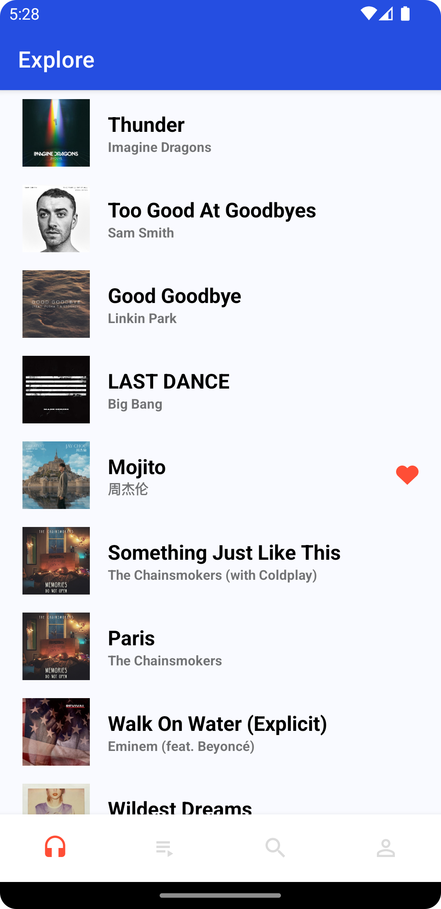
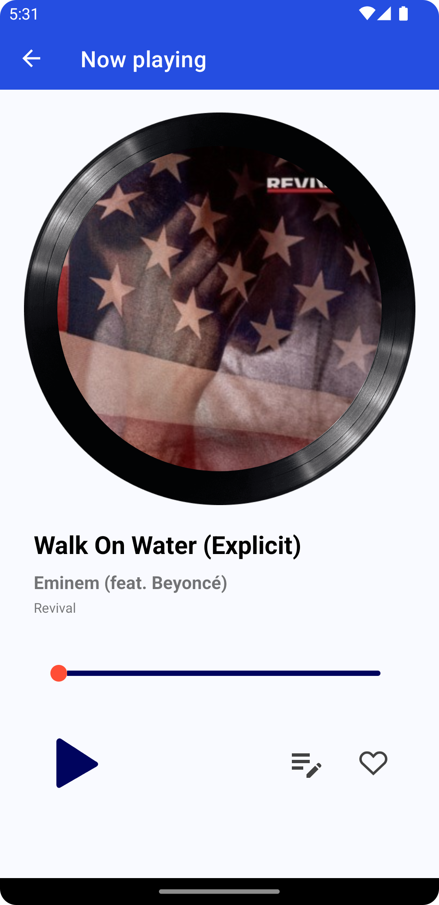
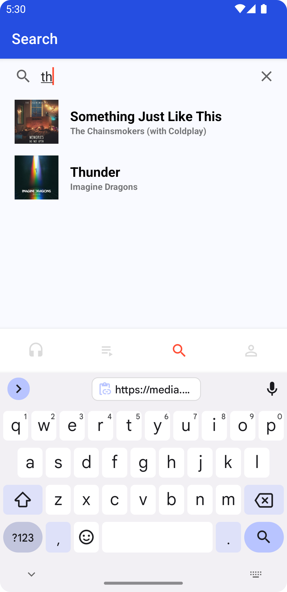
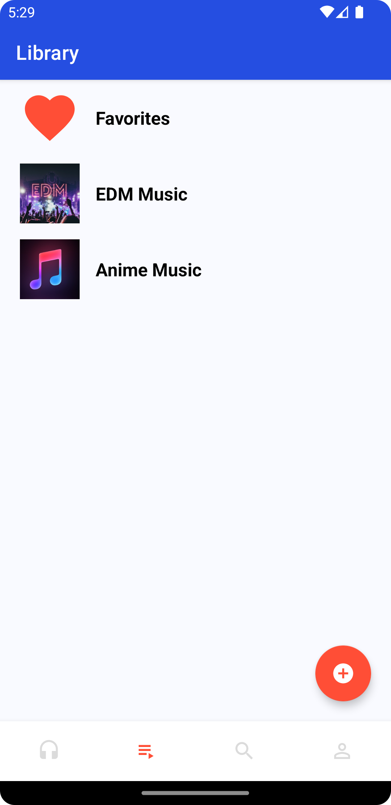
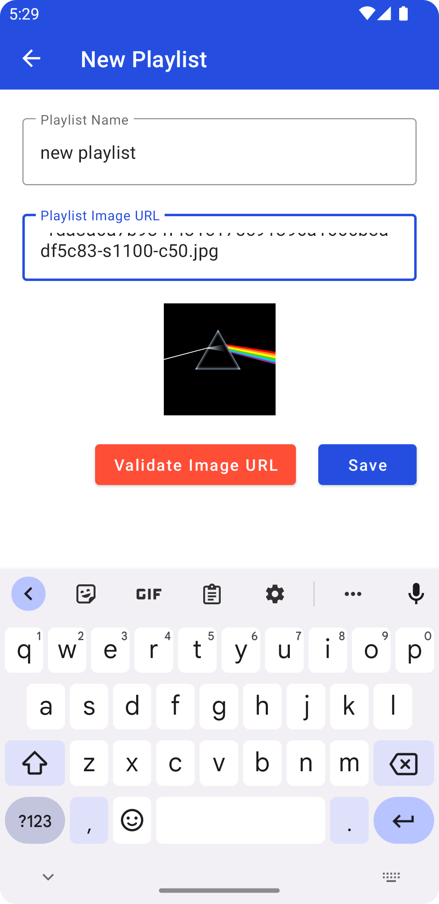
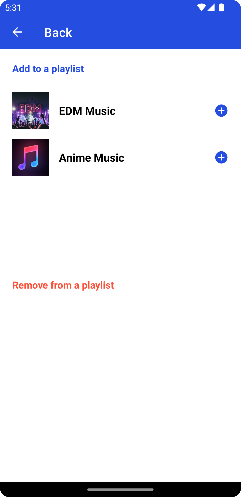

## Wavelength
### Overview
An Full-stack Android Development project. The result is an app capable of the following functionalities:
- Display a list of songs
- Display a list of playlists
- Search for songs in the library
- Create and delete playlists
- Add songs to and remove songs from playlists
### Screenshots
All Songs Page            |  Player Page|  Search Page
:-------------------------:|:-------------------------:|:-------------------------:
  |  |  

  Playlist Page|Create New Playlist Page            |  Update Playlist Page
:-------------------------:|:-------------------------:|:-------------------------:
|  |  

### Technology used
#### Frontend
- Kotlin
- Retrofit
- Wasabeef animations
- Coil
- Glide
- Coroutines
- Android Studio
#### Backend
- Spring Boot
- Java 11
- Mongo Java Driver
- IntelliJ
#### Database
- MongoDB
- MongoDB Atlas
- Digital Ocean Spaces
- Amazon S3
#### Deployment
- Heroku

### For more detail
Check out this [page](https://rkguo.xyz/project-blog-details-wavelength) on my personal website
